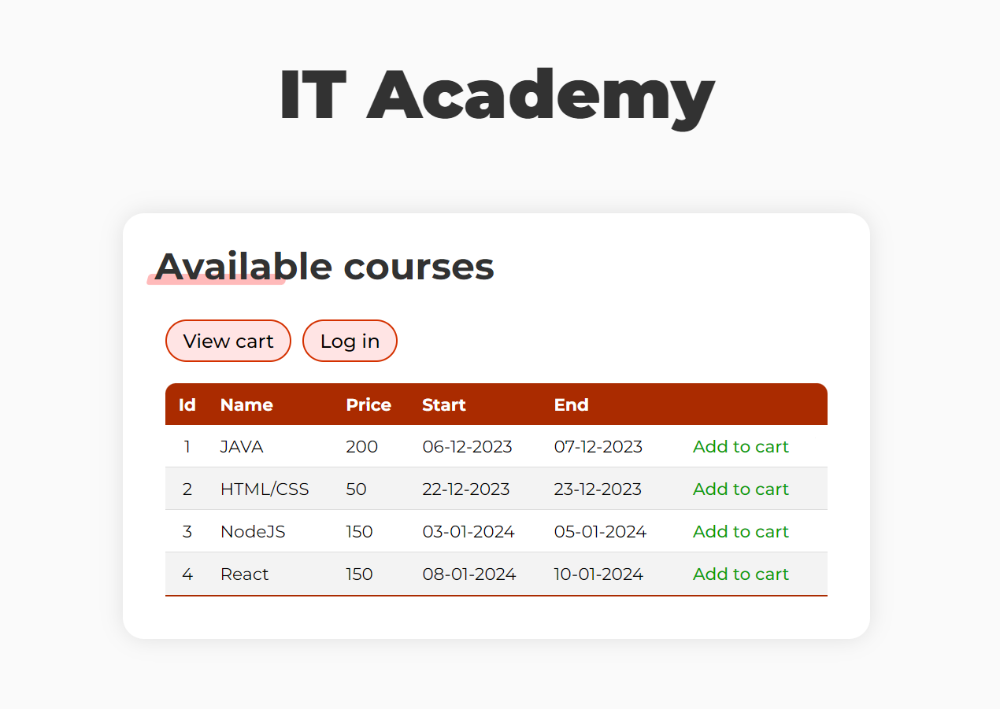
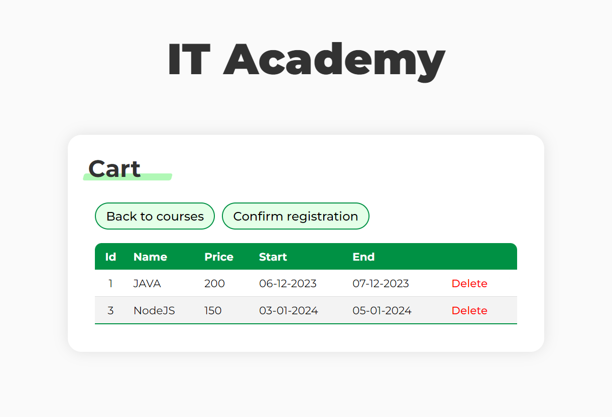
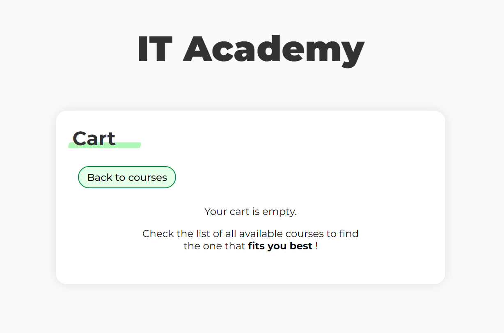
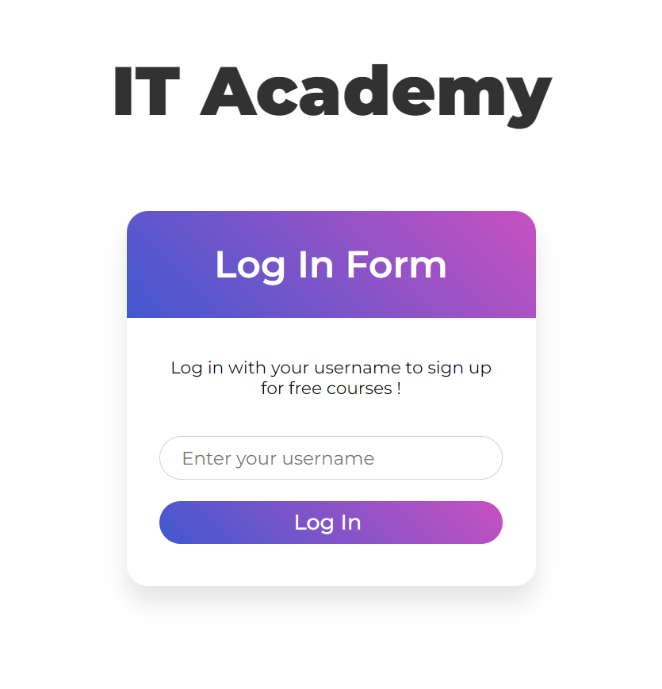

# IT Academy



## Concept

Website following _MVC design pattern_ allowing subscriptions for IT courses linked to a database.
The user is able to consult current courses and sign up for them.

Users should be logged in with a username to sign up for a course. He can be part of multiple courses by selecting them, so they appear in the cart. Once the user has chosen the courses he wants to follow, he can confirm his inscriptions from the cart.

Data concerning the different courses are stored in a database and can't be accessed within the website.







## Installation

To install the Academy on your own server, please make sure **NodeJS** is installed and clone the **GitHub repository** :

```shell
npm install node
```

```shell
git clone https://github.com/NJurquet/Techno_Web-IT_Academy.git
```

Navigate to the project folder and install the required dependencies :

```shell
cd ./Techno_Web-IT_Academy
```

```shell
npm install
```

You are now ready to start the server with :

```shell
node server.js
```
